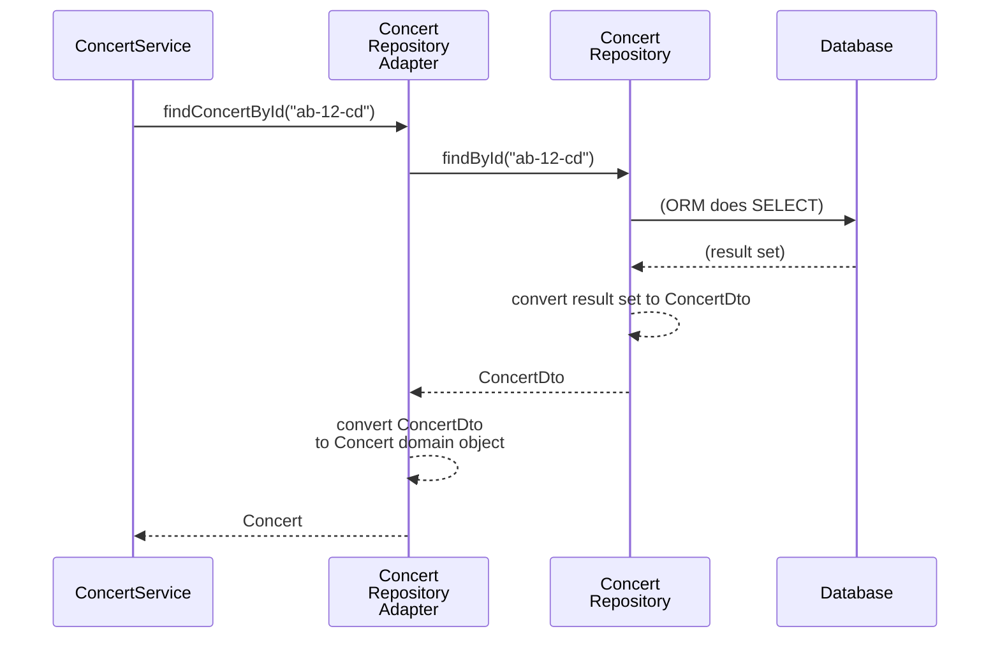

```mermaid
sequenceDiagram
    participant ConcertService
    participant ConcertRepositoryAdapter as Concert<br/>Repository<br/>Adapter
    participant ConcertRepository as Concert<br/>Repository
    participant Database
    ConcertService->>ConcertRepositoryAdapter: findConcertById("ab-12-cd")
    ConcertRepositoryAdapter->>ConcertRepository: findById("ab-12-cd")
    ConcertRepository->>Database: (ORM does SELECT)
    Database-->>ConcertRepository: (result set)
    ConcertRepository-->>ConcertRepository: convert result set to ConcertDto
    ConcertRepository-->>ConcertRepositoryAdapter: ConcertDto
    ConcertRepositoryAdapter-->>ConcertRepositoryAdapter: convert ConcertDto<br/> to Concert domain object
    ConcertRepositoryAdapter-->>ConcertService: Concert


```